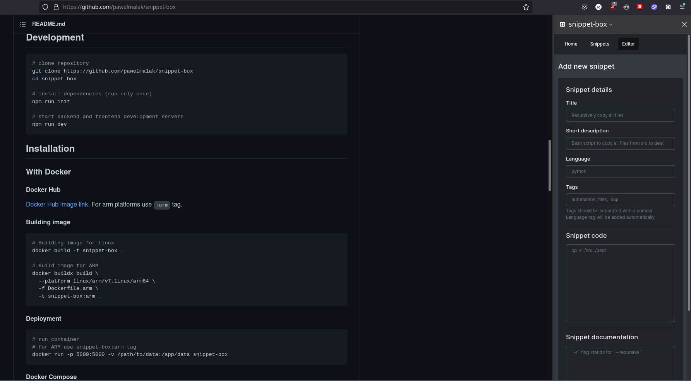

# Snippet Box Sidebar
This extension adds a [Snippet Box](https://github.com/pawelmalak/snippet-box) sidebar to your Firefox as shown in screenshot below. This allows you to save code snippets without leaving the web page you are on and breaking your workflow. Entire web application itself is opened in side bar so you can search and browse your snippets as well. 

**Once addon is installed you need to provide your Snippet Box instance url in preferences of the extension for it to work properly.**

Your feedback is highly appreciated.

